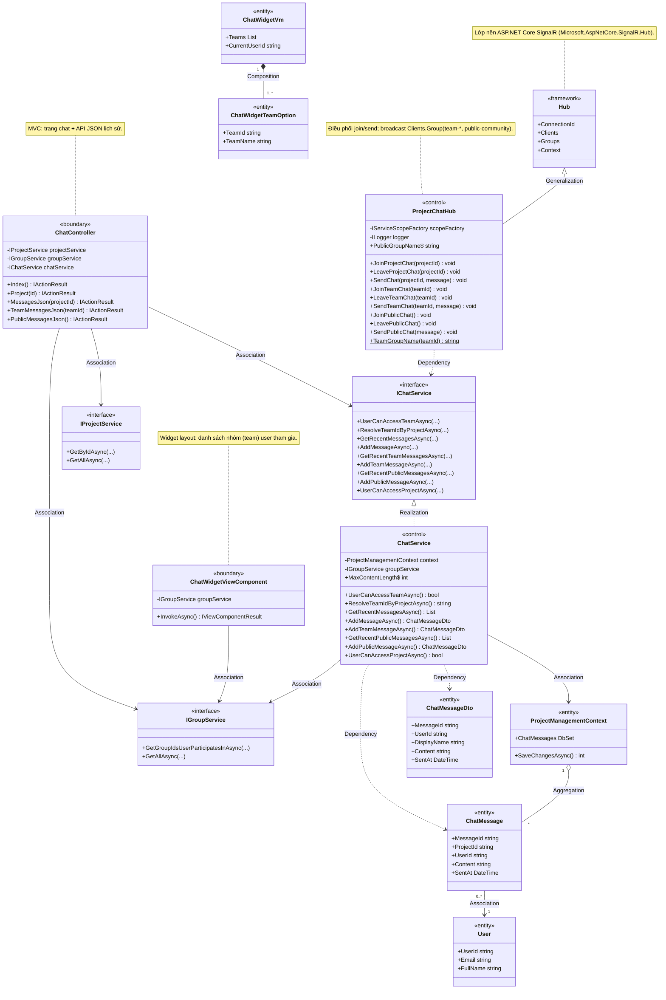
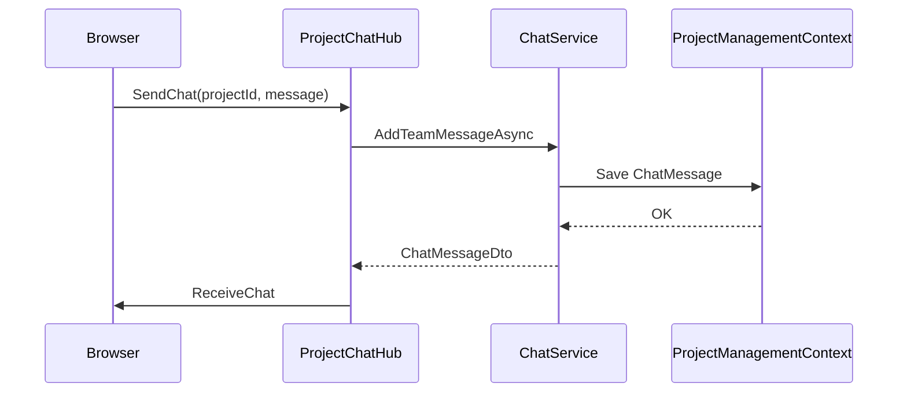

# Class diagram — Chat realtime (SignalR), theo chuẩn UML (mẫu tham chiếu)

Sơ đồ bên dưới **bám ký hiệu UML** như ảnh mẫu (stereotype, **Attribute** / **Operation**, quan hệ **Generalization**, **Association**, **Aggregation** thoi rỗng, **Composition** thoi đặc, **Dependency** nét đứt, **Note**).

**Ánh xạ Mermaid → UML (giống ảnh mẫu):**

| UML (ảnh mẫu) | Mermaid `classDiagram` |
|---------------|-------------------------|
| Generalization (kế thừa, tam giác rỗng về lớp cha) | `\|&lt;--` |
| Realization (interface ← class) | `\|&lt;..` |
| Association (đường liền) | `-->` |
| Aggregation (“has-a” yếu, **thoi rỗng** phía whole) | `o--` |
| Composition (“has-a” mạnh, **thoi đặc** phía whole) | `*--` |
| Dependency (nét đứt, phụ thuộc) | `..>` |
| Ghi chú (note gấp góc) | `note for Class "..."` |

---

## Sơ đồ lớp (Mermaid — bản đầy đủ)

> Render: VS Code Markdown Preview, GitHub, [mermaid.live](https://mermaid.live).

---

## Giải thích khớp ảnh mẫu (từng thành phần)

| Thành phần ảnh mẫu | Áp dụng trong sơ đồ Chat |
|--------------------|---------------------------|
| **Stereotype** `<<entity>>` | `ChatMessage`, `ChatMessageDto`, `User`, `ProjectManagementContext`, `ChatWidgetVm`, `ChatWidgetTeamOption` (dữ liệu / DTO / EF) |
| **Stereotype** `<<boundary>>` | `ChatController`, `ChatWidgetViewComponent` (HTTP / UI component) |
| **Stereotype** `<<control>>` | `ProjectChatHub`, `ChatService` (điều phối + nghiệp vụ) |
| **Stereotype** `<<interface>>` | `IChatService`, `IGroupService`, `IProjectService` |
| **Generalization** | `Hub` → `ProjectChatHub` (tam giác rỗng về `Hub`) |
| **Realization** | `IChatService` → `ChatService` |
| **Association** (đường liền) | Controller / Service → interface hoặc DbContext |
| **Aggregation** (thoi **rỗng**) | `ProjectManagementContext` chứa nhiều `ChatMessage` (`1` — `*`) |
| **Composition** (thoi **đặc**) | `ChatWidgetVm` gồm các `ChatWidgetTeamOption` |
| **Dependency** (nét đứt) | Hub dùng `IChatService` qua scope; `ChatService` map/sinh `ChatMessage` / DTO |
| **Note** | Ghi chú vai trò `Hub`, Hub con, Controller, ViewComponent |

*Nhánh `ChatMessage` → `User`: association (FK); multiplicity gợi ý 0..* tin trên 1 user (tùy dữ liệu).*

---

## Đăng ký ứng dụng

- `Program.cs`: `AddSignalR()`, `MapHub~ProjectChatHub~("/hubs/projectchat")`.
- DI: `IChatService` → `ChatService` (scoped).

---

## File nguồn

| File |
|------|
| `Hubs/ProjectChatHub.cs` |
| `Controllers/ChatController.cs` |
| `Services/Interfaces/IChatService.cs` |
| `Services/Implementations/ChatService.cs` |
| `Models/ChatMessage.cs`, `Models/User.cs` |
| `Models/ViewModels/ChatMessageDto.cs`, `ChatWidgetVm.cs` |
| `ViewComponents/ChatWidgetViewComponent.cs` |

---

## Sequence (tham khảo — không thuộc class diagram)

