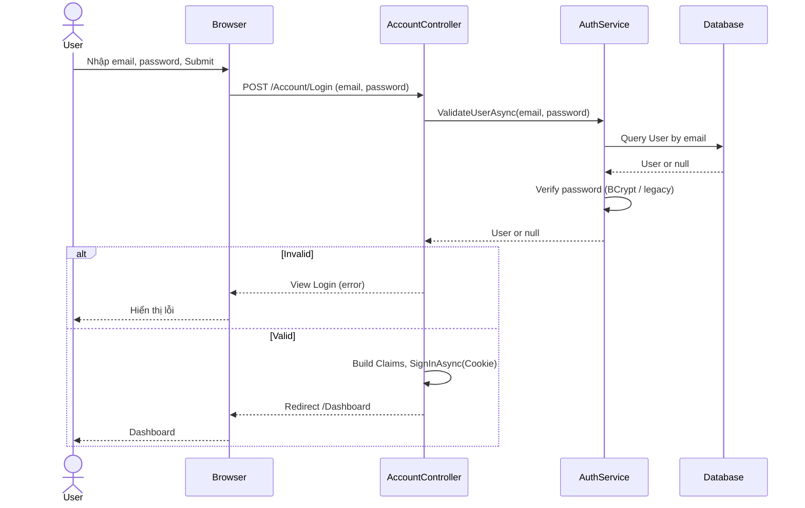
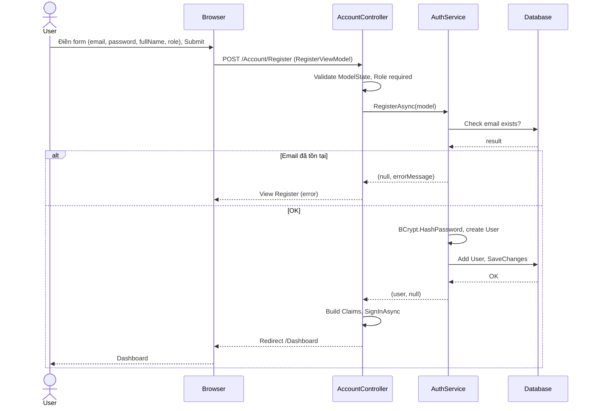
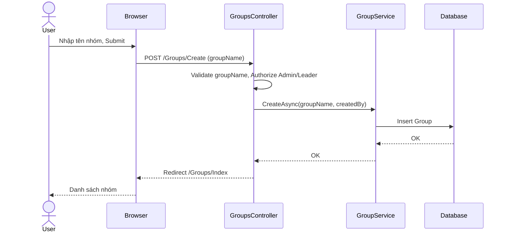
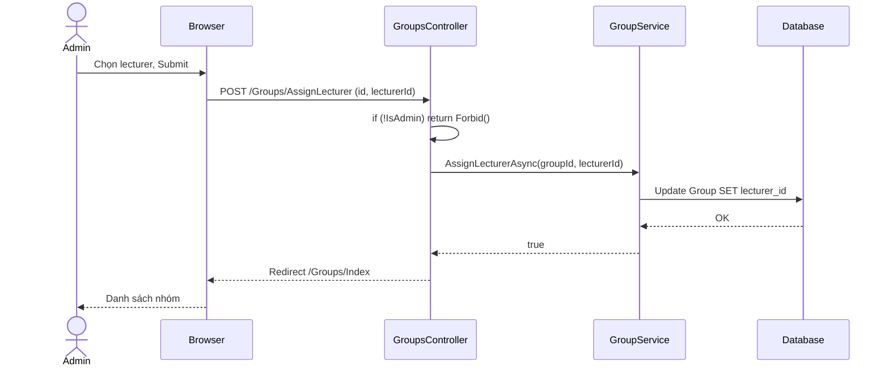
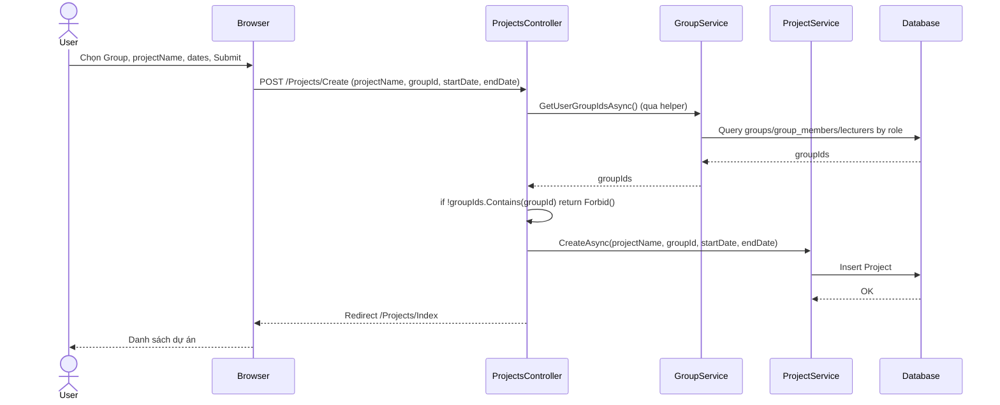
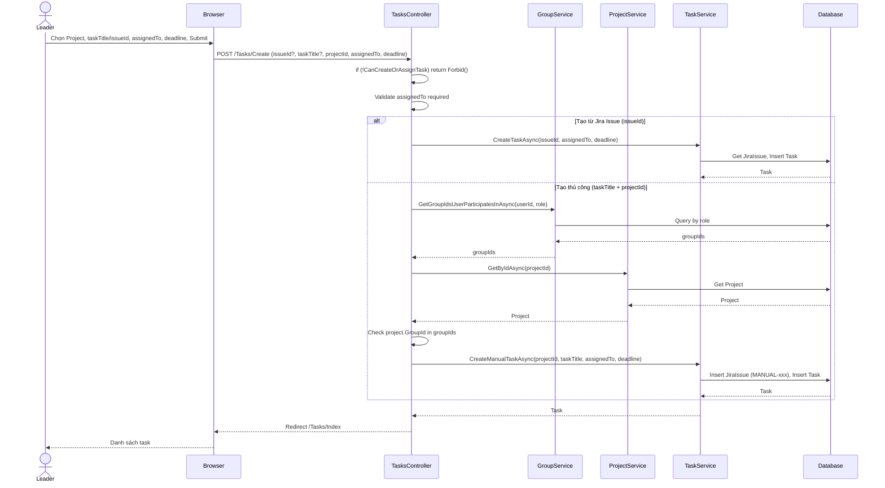
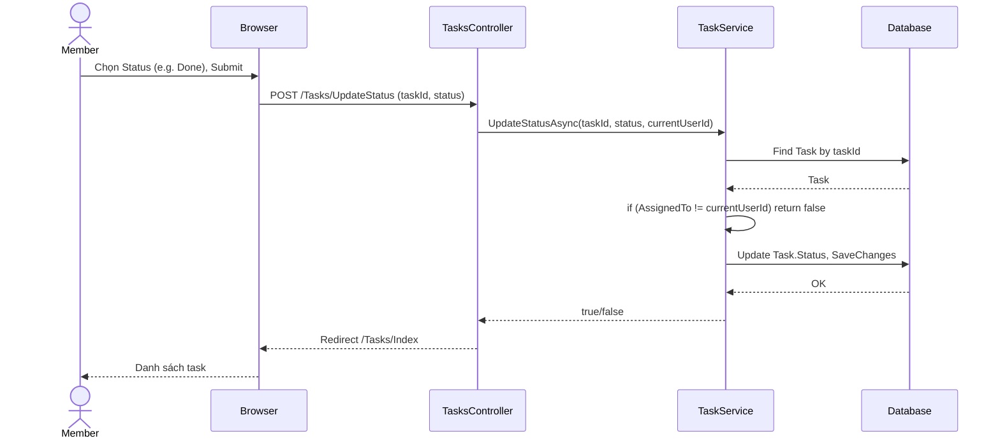
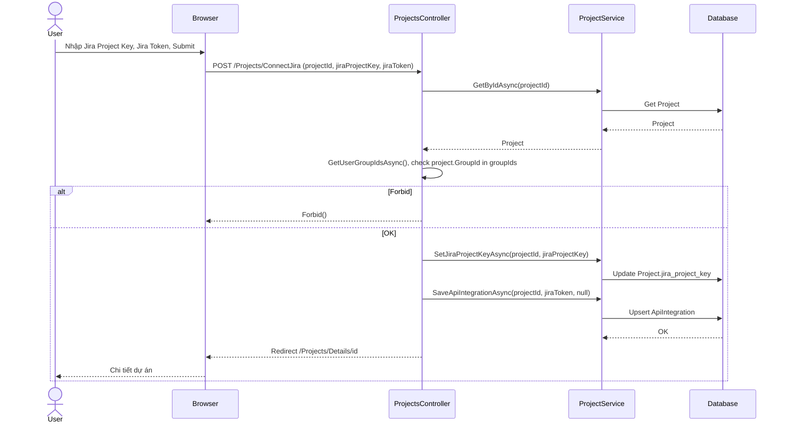

# III.1.1 Sequence Diagram

Sơ đồ tuần tự (Sequence Diagram) cho các luồng chính của web **SWD1813 / SWP Tracker** (quản lý dự án, nhóm, task; tích hợp Jira & GitHub). Thể hiện tương tác giữa User, Browser, Controller, Service và Database theo đúng code hiện tại.

---

## 1. Đăng nhập (Login)

**Luồng:** User nhập email, password → Browser POST `/Account/Login` → AccountController gọi AuthService.ValidateUserAsync → Database; nếu hợp lệ thì SignIn (Cookie) và redirect Dashboard.

---

## 2. Đăng ký (Register)

**Luồng:** User điền form (email, password, fullName, role) → AccountController validate → AuthService.RegisterAsync (kiểm tra email, BCrypt, lưu User) → SignIn → Redirect Dashboard.

---

## 3. Tạo nhóm (Create Group) – Admin/Leader

**Luồng:** User (Admin hoặc Leader) nhập tên nhóm → GroupsController.Create POST → GroupService.CreateAsync → Database Insert Group → Redirect /Groups/Index.

---

## 4. Gán giảng viên cho nhóm (Assign Lecturer) – Admin

**Luồng:** Admin chọn nhóm và lecturer → GroupsController.AssignLecturer POST → kiểm tra IsAdmin → GroupService.AssignLecturerAsync → Database Update Group.lecturer_id → Redirect Index.

---

## 5. Tạo dự án (Create Project)

**Luồng:** User chọn Group (thuộc quyền), nhập projectName, ngày → ProjectsController.Create POST → GetUserGroupIdsAsync, kiểm tra groupId ∈ groupIds → ProjectService.CreateAsync → Database Insert Project → Redirect /Projects/Index.

---

## 6. Tạo task & giao thành viên (Create Task) – Leader

**Luồng:** Leader chọn Project, nhập taskTitle (hoặc chọn Jira Issue), assignedTo, deadline → TasksController.Create POST → kiểm tra CanCreateOrAssignTask → GroupService/ProjectService kiểm tra quyền → TaskService.CreateManualTaskAsync hoặc CreateTaskAsync (JiraIssue + Task) → Redirect /Tasks/Index.

---

## 7. Cập nhật trạng thái task (Update Task Status) – Assignee

**Luồng:** Thành viên được giao task chọn Status (To Do / In Progress / Done) → TasksController.UpdateStatus POST → TaskService.UpdateStatusAsync (chỉ thành công khi task.AssignedTo == currentUserId) → Database Update Task.Status → Redirect /Tasks/Index.

---

## 8. Kết nối Jira (Connect Jira)

**Luồng:** User mở Project Details → Connect Jira, nhập Jira Project Key và Jira Token → ProjectsController.ConnectJira POST → kiểm tra quyền project → ProjectService.SetJiraProjectKeyAsync, SaveApiIntegrationAsync → Database → Redirect /Projects/Details.

---

## Tổng hợp

| STT | Luồng | Actor | Controller | Service |
|-----|-------|-------|------------|---------|
| 1 | Login | User | AccountController | AuthService |
| 2 | Register | User | AccountController | AuthService |
| 3 | Create Group | Admin/Leader | GroupsController | GroupService |
| 4 | Assign Lecturer | Admin | GroupsController | GroupService |
| 5 | Create Project | User | ProjectsController | GroupService, ProjectService |
| 6 | Create Task | Leader | TasksController | GroupService, ProjectService, TaskService |
| 7 | Update Task Status | Member (Assignee) | TasksController | TaskService |
| 8 | Connect Jira | User | ProjectsController | ProjectService |

Tài liệu và sơ đồ được sinh theo đúng code web hiện tại (AccountController, GroupsController, ProjectsController, TasksController và các service tương ứng).
