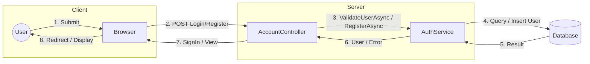
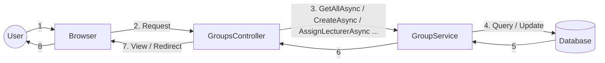
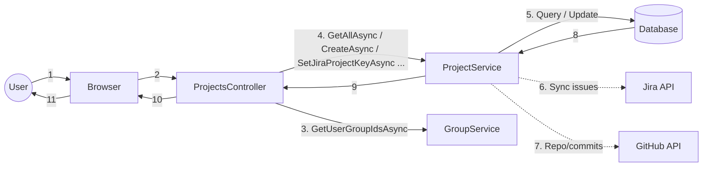
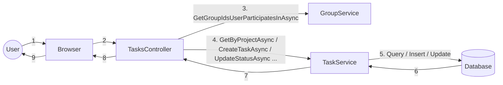
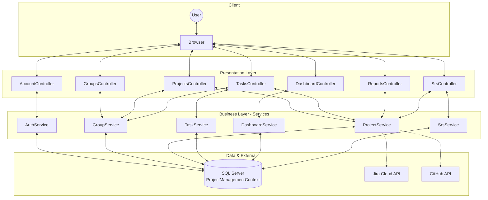
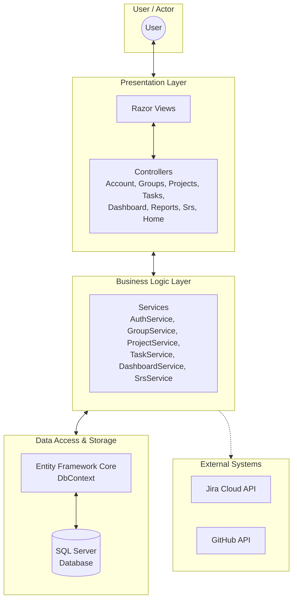
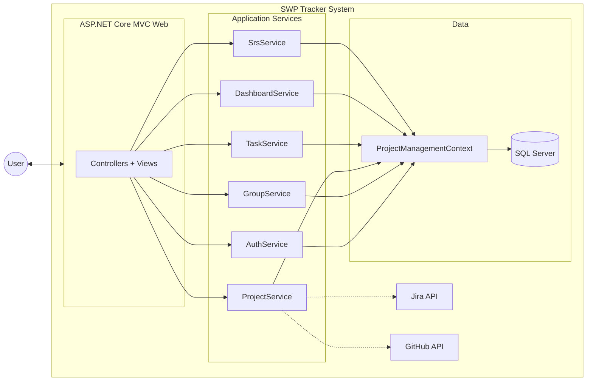

# IV. Design Specification

Tài liệu mô tả thiết kế hệ thống SWP Tracker (Web SWD1813): **IV.1 Integrated Communication Diagrams** và **IV.2 System High-Level Design**.

---

## IV.1 Integrated Communication Diagrams

Sơ đồ mô tả **luồng tương tác (communication)** giữa các thành phần chính: User/Browser, Controllers, Services, Database và hệ thống ngoài (Jira, GitHub). Mỗi số/label trên đường nối thể hiện thông điệp hoặc gọi hàm.

### IV.1.1 Communication – Đăng nhập / Đăng ký

### IV.1.2 Communication – Nhóm (Groups)

### IV.1.3 Communication – Dự án (Projects) và tích hợp Jira/GitHub

### IV.1.4 Communication – Task

### IV.1.5 Tổng hợp Integrated Communication (một sơ đồ tổng)

---

## IV.2 System High-Level Design

Kiến trúc tổng quan hệ thống: các tầng (layer) và thành phần chính.

### IV.2.1 Sơ đồ High-Level Design (layers)

### IV.2.2 Sơ đồ High-Level – Component view

### IV.2.3 Bảng mô tả các tầng

| Tầng | Thành phần | Trách nhiệm |
|------|------------|-------------|
| **Presentation** | Razor Views, Controllers | Nhận request từ Browser, gọi Services, trả View/Redirect. |
| **Business Logic** | AuthService, GroupService, ProjectService, TaskService, DashboardService, SrsService | Nghiệp vụ: xác thực, quản lý nhóm/dự án/task, báo cáo, SRS. Gọi DbContext và (khi cần) Jira/GitHub. |
| **Data Access** | ProjectManagementContext (EF Core) | Truy vấn, thêm/sửa/xóa bảng (Users, Groups, Projects, Tasks, JiraIssues, …). |
| **Data Storage** | SQL Server | Lưu trữ dữ liệu. |
| **External** | Jira Cloud API, GitHub API | Cung cấp issues (Jira), repository và commits (GitHub). |

---

## Tóm tắt

- **IV.1 Integrated Communication Diagrams:** Thể hiện luồng tương tác (message/request) giữa User, Browser, Controllers, Services, Database và Jira/GitHub cho từng nhóm chức năng (Login/Register, Groups, Projects, Tasks) và một sơ đồ tổng hợp.
- **IV.2 System High-Level Design:** Thể hiện kiến trúc tầng (Presentation → Business → Data → External) và component chính của hệ thống SWP Tracker.

Có thể copy từng khối Mermaid vào [Mermaid Live Editor](https://mermaid.live) hoặc công cụ hỗ trợ Mermaid để xuất PNG/SVG.
