# Use Case Diagram – SWP Tracker (Web SWD1813)

Biểu đồ Use Case minh họa các chức năng chính và các tác nhân (actor) tương tác với hệ thống quản lý dự án (nhóm, dự án, task; tích hợp Jira & GitHub). Cấu trúc theo mẫu: ranh giới hệ thống, actors bên ngoài, use cases bên trong, có quan hệ `<<include>>` và `<<extend>>`.

---

## 1. Mô tả tổng quan

- **Ranh giới hệ thống:** Một hình chữ nhật lớn bao quanh tất cả các use case, đại diện cho phạm vi hệ thống **SWP Tracker** (ứng dụng web quản lý dự án, nhóm sinh viên, task, SRS, báo cáo).
- **Tác nhân:** Bảy tác nhân đặt **bên ngoài** ranh giới: **Guest**, **Admin**, **Lecturer**, **Leader**, **Member**, **Jira Cloud**, **GitHub**. Mỗi tác nhân nối với các use case mà họ thực hiện.
- **Use cases:** Các chức năng được nhóm theo lĩnh vực (Đăng nhập/Đăng ký, Nhóm, Dự án, Task, SRS, Báo cáo) và theo từng actor có quyền thực hiện.

---

## 2. Ranh giới hệ thống

- **Hệ thống:** SWP Tracker (Web SWD1813).
- **Bên trong ranh giới:** Toàn bộ use case (Login, Register, View Dashboard, Manage Groups, Manage Projects, Manage Tasks, View/Generate SRS, View Reports, Connect Jira, Connect GitHub, …).
- **Bên ngoài ranh giới:** Các actor (Guest, Admin, Lecturer, Leader, Member, Jira Cloud, GitHub).

---

## 3. Các tác nhân (Actors)

| Actor | Mô tả |
|-------|--------|
| **Guest** | Người chưa đăng nhập. Chỉ thực hiện Login và Register. |
| **Admin** | Quản trị viên: quản lý nhóm (tạo, sửa, xóa, gán giảng viên, thêm/xóa thành viên); xem Dashboard, Projects, Reports, SRS; không vào màn Tasks (theo ma trận quyền). |
| **Lecturer** | Giảng viên: xem nhóm được gán, Dashboard, Projects, Tasks, SRS, Reports; không tạo/xóa nhóm, không gán lecturer, không tạo/giao task. |
| **Leader** | Team Leader: tạo/sửa nhóm, thêm/xóa thành viên (không xóa nhóm, không gán lecturer); quản lý project; tạo task, giao task; cập nhật trạng thái task nếu là assignee; xem SRS, Reports. |
| **Member** | Thành viên nhóm: xem Dashboard, Projects, Tasks, SRS, Reports; chỉ cập nhật trạng thái task khi là người được giao (Assignee). |
| **Jira Cloud** | Hệ thống ngoài: cung cấp Jira issues khi hệ thống kết nối Jira (Connect Jira / đồng bộ). |
| **GitHub** | Hệ thống ngoài: cung cấp repository và commits khi hệ thống kết nối GitHub (Connect GitHub). |

---

## 4. Các trường hợp sử dụng (Use Cases) và mối quan hệ

### 4.1. Use case liên quan đến **Guest**

| Use Case | Mô tả |
|----------|--------|
| **Login** | Đăng nhập bằng email và mật khẩu. |
| **Register** | Đăng ký tài khoản (email, password, fullName, role bắt buộc). |

---

### 4.2. Use case liên quan đến **Admin**

| Use Case | Mô tả |
|----------|--------|
| **Logout** | Đăng xuất. |
| **View Dashboard** | Xem tổng quan (nhóm, dự án, tiến độ). |
| **View Groups** | Xem danh sách nhóm. |
| **View Group Details** | Xem chi tiết nhóm (thành viên, giảng viên). |
| **Create Group** | Tạo nhóm mới. |
| **Edit Group** | Sửa thông tin nhóm. |
| **Delete Group** | Xóa nhóm (chỉ Admin). |
| **Assign Lecturer to Group** | Gán giảng viên cho nhóm (chỉ Admin). |
| **Add Member to Group** | Thêm thành viên vào nhóm. |
| **Remove Member from Group** | Xóa thành viên khỏi nhóm. |
| **View Projects** | Xem danh sách dự án (theo nhóm). |
| **Create Project** | Tạo dự án thuộc nhóm. |
| **Edit Project** | Sửa dự án. |
| **View Project Details** | Xem chi tiết dự án. |
| **Connect Jira** | Kết nối Jira (Project Key, API Token) cho dự án. |
| **Connect GitHub** | Kết nối GitHub (token/repo) cho dự án. |
| **View SRS** | Xem danh sách SRS / requirements. |
| **Generate SRS** | Tạo tài liệu SRS từ dự án. |
| **View Reports** | Xem báo cáo. |

*Ghi chú:* Admin **không** có use case View Tasks / Create Task / Assign Task / Update Task Status (theo ma trận quyền trong code).

---

### 4.3. Use case liên quan đến **Lecturer**

| Use Case | Mô tả |
|----------|--------|
| **Logout** | Đăng xuất. |
| **View Dashboard** | Xem tổng quan (theo nhóm được gán). |
| **View Groups** | Xem danh sách nhóm được gán. |
| **View Group Details** | Xem chi tiết nhóm. |
| **View Projects** | Xem danh sách dự án. |
| **View Project Details** | Xem chi tiết dự án. |
| **View Tasks** | Xem danh sách task (theo nhóm). |
| **View SRS** | Xem SRS / requirements. |
| **Generate SRS** | Tạo tài liệu SRS từ dự án. |
| **View Reports** | Xem báo cáo. |

*Ghi chú:* Lecturer không tạo/sửa/xóa nhóm, không gán lecturer, không tạo/giao task, không Connect Jira/GitHub (chỉ xem).

---

### 4.4. Use case liên quan đến **Leader**

| Use Case | Mô tả |
|----------|--------|
| **Logout** | Đăng xuất. |
| **View Dashboard** | Xem tổng quan. |
| **View Groups** | Xem danh sách nhóm. |
| **View Group Details** | Xem chi tiết nhóm. |
| **Create Group** | Tạo nhóm mới. |
| **Edit Group** | Sửa thông tin nhóm (nhóm mình quản lý). |
| **Add Member to Group** | Thêm thành viên vào nhóm. |
| **Remove Member from Group** | Xóa thành viên khỏi nhóm. |
| **View Projects** | Xem danh sách dự án. |
| **Create Project** | Tạo dự án thuộc nhóm. |
| **Edit Project** | Sửa dự án. |
| **View Project Details** | Xem chi tiết dự án. |
| **Connect Jira** | Kết nối Jira cho dự án. |
| **Connect GitHub** | Kết nối GitHub cho dự án. |
| **View Tasks** | Xem danh sách task. |
| **Create Task** | Tạo task (từ Jira issue hoặc tạo thủ công) và giao thành viên. |
| **Assign Task** | Giao task cho thành viên, đặt deadline. |
| **Update Task Status** | Cập nhật trạng thái task (chỉ khi Leader là Assignee). |
| **View SRS** | Xem SRS. |
| **Generate SRS** | Tạo tài liệu SRS. |
| **View Reports** | Xem báo cáo. |

*Ghi chú:* Leader **không** Delete Group, **không** Assign Lecturer to Group.

---

### 4.5. Use case liên quan đến **Member**

| Use Case | Mô tả |
|----------|--------|
| **Logout** | Đăng xuất. |
| **View Dashboard** | Xem tổng quan. |
| **View Projects** | Xem danh sách dự án. |
| **View Project Details** | Xem chi tiết dự án. |
| **View Tasks** | Xem danh sách task. |
| **Update Task Status** | Cập nhật trạng thái task (chỉ khi Member là Assignee). |
| **View SRS** | Xem SRS. |
| **Generate SRS** | Tạo tài liệu SRS từ dự án (theo quyền). |
| **View Reports** | Xem báo cáo. |

*Ghi chú:* Member không quản lý nhóm, không tạo/sửa project, không tạo/giao task; chỉ xem và Update Task Status khi được giao task.

---

### 4.6. Use case liên quan đến **Jira Cloud** và **GitHub**

| Actor | Use Case | Mô tả |
|-------|----------|--------|
| **Jira Cloud** | Cung cấp Jira issues | Hệ thống gọi Jira API khi Connect Jira / đồng bộ issues. |
| **GitHub** | Cung cấp Repository & Commits | Hệ thống kết nối GitHub khi Connect GitHub; lấy repo, commits. |

---

## 5. Quan hệ <<include>> và <<extend>>

| Quan hệ | Use Case gốc | Use Case phụ | Ý nghĩa |
|---------|--------------|--------------|---------|
| **<<include>>** | Login | Validate credentials | Đăng nhập luôn bao gồm xác thực tài khoản. |
| **<<include>>** | Register | Validate email & role | Đăng ký luôn kiểm tra email chưa tồn tại và role hợp lệ. |
| **<<include>>** | Create Task | Select Project & Member | Tạo task luôn cần chọn dự án và thành viên nhận task. |
| **<<include>>** | Connect Jira | Save Jira credentials | Kết nối Jira luôn lưu Project Key và API Token. |
| **<<extend>>** | View Project Details | Connect Jira | Trong màn chi tiết dự án, có thể mở rộng thao tác Connect Jira. |
| **<<extend>>** | View Project Details | Connect GitHub | Trong màn chi tiết dự án, có thể mở rộng thao tác Connect GitHub. |

*Điều kiện mở rộng:* **Update Task Status** chỉ thực hiện được khi user là **Assignee** (người được giao task).

---

## 6. Sơ đồ từ ảnh – đã nối Actor với Use case theo web

Dùng đúng **actor** và **tên use case** như trong ảnh (Admin, Lecture, Leader, Member, Jira, Git; Login/out, View group, Create Group, …). Các đường nối (association) giữa actor và use case được xác định **theo quyền thực tế trên web** (Admin không Tasks; Lecture chỉ xem; Leader tạo/sửa nhóm, tạo/giao task; Member xem và Update task khi là Assignee; Jira/Git nối Connect Jira / Connect Git).

```mermaid
flowchart LR
    subgraph SWP["SWP Tracker"]
        LoginOut([Login/out])
        Register([Register])
        ViewDashboard([View Dashboard])
        ViewGroup([View group])
        ViewDetails([View details])
        CreateGroup([Create Group])
        EditGroup([Edit Group])
        DeleteGroup([Delete Group])
        AssignLectureToGroup([Assign Lecture to group])
        AddMember([Add member])
        RemoveMember([Remove member])
        ViewsProject([Views project])
        CreateProject([Create Project])
        ViewProjectDetails([View project details])
        ConnectJira([Connect Jira])
        ConnectGit([Connect Git])
        SaveJira([Save Jira])
        SelectProjectForMember([Select Project for member])
        ViewsTask([Views Task])
        CreateTask([Create task])
        AssignTask([Assign Task])
        UpdateTask([Update task])
        GenerateSRS([Generate SRS])
        ViewReportsSRS([View reports SRS])
    end

    Guest((Guest))
    Admin((Admin))
    Lecture((Lecture))
    Leader((Leader))
    Member((Member))
    Jira((Jira))
    Git((Git))

    Guest --- LoginOut
    Guest --- Register

    Admin --- LoginOut
    Admin --- ViewDashboard
    Admin --- ViewGroup
    Admin --- ViewDetails
    Admin --- CreateGroup
    Admin --- EditGroup
    Admin --- DeleteGroup
    Admin --- AssignLectureToGroup
    Admin --- AddMember
    Admin --- RemoveMember
    Admin --- ViewsProject
    Admin --- CreateProject
    Admin --- ViewProjectDetails
    Admin --- ConnectJira
    Admin --- ConnectGit
    Admin --- GenerateSRS
    Admin --- ViewReportsSRS

    Lecture --- LoginOut
    Lecture --- ViewDashboard
    Lecture --- ViewGroup
    Lecture --- ViewDetails
    Lecture --- ViewsProject
    Lecture --- ViewProjectDetails
    Lecture --- ViewsTask
    Lecture --- GenerateSRS
    Lecture --- ViewReportsSRS

    Leader --- LoginOut
    Leader --- ViewDashboard
    Leader --- ViewGroup
    Leader --- ViewDetails
    Leader --- CreateGroup
    Leader --- EditGroup
    Leader --- AddMember
    Leader --- RemoveMember
    Leader --- ViewsProject
    Leader --- CreateProject
    Leader --- ViewProjectDetails
    Leader --- ConnectJira
    Leader --- ConnectGit
    Leader --- ViewsTask
    Leader --- CreateTask
    Leader --- AssignTask
    Leader --- UpdateTask
    Leader --- GenerateSRS
    Leader --- ViewReportsSRS

    Member --- LoginOut
    Member --- ViewDashboard
    Member --- ViewsProject
    Member --- ViewProjectDetails
    Member --- ViewsTask
    Member --- UpdateTask
    Member --- GenerateSRS
    Member --- ViewReportsSRS

    ConnectJira -.->|<<include>>| SaveJira
    CreateTask -.->|<<include>>| SelectProjectForMember
    CreateTask -.->|<<include>>| AssignTask
    ConnectJira -.->|<<extend>>| ViewProjectDetails
    ConnectGit -.->|<<extend>>| ViewProjectDetails

    Jira -.-> ConnectJira
    Git -.-> ConnectGit
```

### Bảng nối Actor – Use case (theo web)

| Actor | Use case được nối (theo web) |
|-------|------------------------------|
| **Guest** | Login/out, Register |
| **Admin** | Login/out, View Dashboard, View group, View details, Create Group, Edit Group, Delete Group, Assign Lecture to group, Add member, Remove member, Views project, Create Project, View project details, Connect Jira, Connect Git, Generate SRS, View reports SRS. *Không* Views Task, Create task, Assign Task, Update task. |
| **Lecture** | Login/out, View Dashboard, View group, View details, Views project, View project details, Views Task, Generate SRS, View reports SRS. *Chỉ xem*, không tạo/sửa/xóa nhóm, không Connect Jira/Git, không tạo/giao task. |
| **Leader** | Login/out, View Dashboard, View group, View details, Create Group, Edit Group, Add member, Remove member, Views project, Create Project, View project details, Connect Jira, Connect Git, Views Task, Create task, Assign Task, Update task, Generate SRS, View reports SRS. *Không* Delete Group, *không* Assign Lecture to group. |
| **Member** | Login/out, View Dashboard, Views project, View project details, Views Task, Update task, Generate SRS, View reports SRS. *Không* quản lý nhóm, *không* tạo project, *không* Connect Jira/Git, *không* Create task, Assign Task (Update task chỉ khi là Assignee). |
| **Jira** | Connect Jira (hệ thống ngoài cung cấp issues). |
| **Git** | Connect Git (hệ thống ngoài cung cấp repo/commits). |

---

## 7. Sơ đồ Use Case (Mermaid) – chi tiết đầy đủ và relationship

Ranh giới hệ thống = subgraph **SWP Tracker**. Actors bên ngoài. Trong hệ thống:
- **Association:** đường liền (---) nối Actor với Use case.
- **<<include>>:** đường chấm từ use case gốc tới use case được include (luôn thực hiện).
- **<<extend>>:** đường chấm từ use case mở rộng tới use case gốc (tùy chọn).
- **Actor – hệ thống ngoài:** Jira Cloud, GitHub nối tới Connect Jira / Connect GitHub.

```mermaid
flowchart TB
    subgraph Boundary["══════ SWP Tracker (System Boundary) ══════"]
        direction TB
        subgraph Auth["Authentication"]
            Login([Login])
            Register([Register])
            Logout([Logout])
            ValidateCredentials([Validate Credentials])
            ValidateEmailRole([Validate Email & Role])
        end
        subgraph Dash["Dashboard"]
            ViewDashboard([View Dashboard])
        end
        subgraph GroupUC["Groups"]
            ViewGroups([View Groups])
            ViewGroupDetails([View Group Details])
            CreateGroup([Create Group])
            EditGroup([Edit Group])
            DeleteGroup([Delete Group])
            AssignLecturer([Assign Lecturer to Group])
            AddMember([Add Member to Group])
            RemoveMember([Remove Member from Group])
        end
        subgraph ProjUC["Projects"]
            ViewProjects([View Projects])
            CreateProject([Create Project])
            EditProject([Edit Project])
            ViewProjectDetails([View Project Details])
            ConnectJira([Connect Jira])
            ConnectGitHub([Connect GitHub])
            SaveJiraCredentials([Save Jira Credentials])
        end
        subgraph TaskUC["Tasks"]
            ViewTasks([View Tasks])
            CreateTask([Create Task])
            AssignTask([Assign Task])
            UpdateTaskStatus([Update Task Status])
            SelectProjectMember([Select Project & Member])
        end
        subgraph SRSReports["SRS & Reports"]
            ViewSRS([View SRS])
            GenerateSRS([Generate SRS])
            ViewReports([View Reports])
        end
    end

    Guest((Guest))
    Admin((Admin))
    Lecturer((Lecturer))
    Leader((Leader))
    Member((Member))
    Jira((Jira Cloud))
    GitHub((GitHub))

    %% ========== ASSOCIATION (Actor --- Use Case) ==========
    Guest --- Login
    Guest --- Register

    Admin --- Logout
    Admin --- ViewDashboard
    Admin --- ViewGroups
    Admin --- ViewGroupDetails
    Admin --- CreateGroup
    Admin --- EditGroup
    Admin --- DeleteGroup
    Admin --- AssignLecturer
    Admin --- AddMember
    Admin --- RemoveMember
    Admin --- ViewProjects
    Admin --- CreateProject
    Admin --- EditProject
    Admin --- ViewProjectDetails
    Admin --- ConnectJira
    Admin --- ConnectGitHub
    Admin --- ViewSRS
    Admin --- GenerateSRS
    Admin --- ViewReports

    Lecturer --- Logout
    Lecturer --- ViewDashboard
    Lecturer --- ViewGroups
    Lecturer --- ViewGroupDetails
    Lecturer --- ViewProjects
    Lecturer --- ViewProjectDetails
    Lecturer --- ViewTasks
    Lecturer --- ViewSRS
    Lecturer --- GenerateSRS
    Lecturer --- ViewReports

    Leader --- Logout
    Leader --- ViewDashboard
    Leader --- ViewGroups
    Leader --- ViewGroupDetails
    Leader --- CreateGroup
    Leader --- EditGroup
    Leader --- AddMember
    Leader --- RemoveMember
    Leader --- ViewProjects
    Leader --- CreateProject
    Leader --- EditProject
    Leader --- ViewProjectDetails
    Leader --- ConnectJira
    Leader --- ConnectGitHub
    Leader --- ViewTasks
    Leader --- CreateTask
    Leader --- AssignTask
    Leader --- UpdateTaskStatus
    Leader --- ViewSRS
    Leader --- GenerateSRS
    Leader --- ViewReports

    Member --- Logout
    Member --- ViewDashboard
    Member --- ViewProjects
    Member --- ViewProjectDetails
    Member --- ViewTasks
    Member --- UpdateTaskStatus
    Member --- ViewSRS
    Member --- GenerateSRS
    Member --- ViewReports

    %% ========== <<include>> (base --include--> included) ==========
    Login -.->|<<include>>| ValidateCredentials
    Register -.->|<<include>>| ValidateEmailRole
    CreateTask -.->|<<include>>| SelectProjectMember
    CreateTask -.->|<<include>>| AssignTask
    ConnectJira -.->|<<include>>| SaveJiraCredentials

    %% ========== <<extend>> (extending --extend--> base) ==========
    ConnectJira -.->|<<extend>>| ViewProjectDetails
    ConnectGitHub -.->|<<extend>>| ViewProjectDetails

    %% ========== External actors (Jira, GitHub) ==========
    Jira -.->|provide issues| ConnectJira
    GitHub -.->|provide repo/commits| ConnectGitHub
```

### 7.1. Bảng relationship trong sơ đồ

| Loại | Từ | Đến | Ý nghĩa |
|------|-----|-----|---------|
| **Association** | Guest, Admin, Lecturer, Leader, Member | Các use case tương ứng | Actor thực hiện use case. |
| **<<include>>** | Login | Validate Credentials | Đăng nhập luôn gồm xác thực. |
| **<<include>>** | Register | Validate Email & Role | Đăng ký luôn kiểm tra email và role. |
| **<<include>>** | Create Task | Select Project & Member | Tạo task luôn chọn dự án và thành viên. |
| **<<include>>** | Create Task | Assign Task | Tạo task luôn gồm giao task. |
| **<<include>>** | Connect Jira | Save Jira Credentials | Kết nối Jira luôn lưu thông tin đăng nhập. |
| **<<extend>>** | Connect Jira | View Project Details | Trong xem chi tiết dự án có thể (tùy chọn) Connect Jira. |
| **<<extend>>** | Connect GitHub | View Project Details | Trong xem chi tiết dự án có thể (tùy chọn) Connect GitHub. |
| **External** | Jira Cloud | Connect Jira | Hệ thống ngoài cung cấp issues. |
| **External** | GitHub | Connect GitHub | Hệ thống ngoài cung cấp repo/commits. |

---

## 8. Bảng tóm tắt Actor – Use Case

| Actor | Use Cases |
|-------|-----------|
| **Guest** | Login, Register |
| **Admin** | Logout, View Dashboard, View Groups, View Group Details, Create/Edit/Delete Group, Assign Lecturer, Add/Remove Member, View/Create/Edit Project, View Project Details, Connect Jira, Connect GitHub, View/Generate SRS, View Reports |
| **Lecturer** | Logout, View Dashboard, View Groups, View Group Details, View Projects, View Project Details, View Tasks, View/Generate SRS, View Reports |
| **Leader** | Logout, View Dashboard, View Groups, View Group Details, Create/Edit Group, Add/Remove Member, View/Create/Edit Project, View Project Details, Connect Jira/GitHub, View/Create/Assign Task, Update Task Status, View/Generate SRS, View Reports |
| **Member** | Logout, View Dashboard, View Projects, View Project Details, View Tasks, Update Task Status (nếu Assignee), View/Generate SRS, View Reports |
| **Jira Cloud** | Cung cấp issues (khi Connect Jira). |
| **GitHub** | Cung cấp repo, commits (khi Connect GitHub). |

---

## 9. Ghi chú

- **Admin** không có quyền vào màn **Tasks** (không View Tasks, Create Task, Assign Task, Update Task Status).
- **Delete Group**, **Assign Lecturer to Group** chỉ **Admin**.
- **Create Task**, **Assign Task** chỉ **Leader**.
- **Update Task Status** chỉ thành viên được giao task (**Assignee**) mới thực hiện được.
- Dữ liệu (Groups, Projects, Tasks, Reports, SRS) được **lọc theo nhóm** mà user tham gia (Admin: mọi nhóm; Lecturer: nhóm được gán; Leader/Member: nhóm là thành viên).

File này mô tả Use Case diagram đầy đủ theo web SWP Tracker, có thể dùng cho báo cáo hoặc tài liệu phân tích.
